# Omnibase - Autonomous Drone Landing Platform

<div align="center">


[Quick Start](#quick-start) • [Features](#features) • [Drone Control GUI](#drone-control-gui) • [Architecture](#architecture) • [Packages](#packages) • [Topics](#topics) • [Tuning](#tuning) • [Troubleshooting](#troubleshooting) • [Dependencies](#dependencies)

</div>

---

A ROS2 Jazzy + Gazebo Harmonic simulation of a mecanum wheel base that autonomously tracks and catches a UAV using vision-based control.

## Quick Start

```bash
# Build
cd ~/omnibase_ws
colcon build --symlink-install
source install/setup.bash

# Run
./launch_simulation.sh
```

## Features

- **Mecanum omnidirectional base** with proper anisotropic friction simulation
- **Upward-facing camera** for UAV tracking
- **LED marker detection** using OpenCV blob detection
- **Autonomous tracking** - base follows the drone in real-time
- **Landing sequence** - drone can land on the base with proper state management
- **Drone Control GUI** - intuitive interface for UAV control + landing

## Drone Control GUI

| Button | Action |
|--------|--------|
| **W/A/S/D** | Move drone horizontally |
| **↑ UP / ↓ DOWN** | Altitude control |
| **🛬 LAND** | Initiate landing (enabled when aligned) |
| **🚀 TAKE OFF** | Abort landing / fly again |

### Landing Workflow

1. Move drone until base aligns underneath (status: "✅ DRONE READY TO LAND")
2. Press **LAND** → Base stops, drone descends
3. Press **TAKE OFF** when ready → Drone lifts, tracking resumes after LED visible

## Architecture


## Packages

| Package | Description |
|:--------|:------------|
| `omnibase_description` | URDF with mecanum wheels + camera |
| `omnibase_gazebo` | Gazebo world, models, ROS-GZ bridge |
| `omnibase_control` | Drone GUI, controllers |
| `omnibase_vision` | LED detector, base tracker |
| `omnibase_bringup` | Launch files |

## Topics

| Topic | Type | Description |
|:------|:----:|:------------|
| `/cmd_vel` | `Twist` | Base velocity via VelocityControl plugin |
| `/uav/cmd_vel` | `Twist` | UAV velocity commands |
| `/camera/image_raw` | `Image` | Upward camera feed |
| `/camera/debug` | `Image` | Camera with LED overlay |
| `/led_centroid` | `Point` | LED position (x, y) + area (z) |
| `/landing_status` | `Bool` | True when landing mode active |

## Tuning

### Base Tracker (`vision.launch.py`)
```python
'gain_x': 0.01,           # Strafe response
'gain_y': 0.01,           # Forward response  
'deadband': 15.0,         # Centering tolerance (pixels)
'max_velocity': 1.0,      # Max base speed (m/s)
```

### LED Detector
```python
'brightness_threshold': 200,  # LED brightness (0-255)
'min_blob_area': 10,          # Min LED size (pixels²)
'max_blob_area': 1000,        # Max LED size (pixels²)
```

## Troubleshooting

```mermaid
flowchart LR
    subgraph Issues["⚠️ Common Issues"]
        I1["Gazebo crashes"]
        I2["Base doesn't move"]
        I3["LED not detected"]
        I4["Base jitters"]
    end
    
    subgraph Solutions["✅ Solutions"]
        S1["Set NVIDIA EGL:\nexport __EGL_VENDOR_LIBRARY_FILENAMES=\n.../10_nvidia.json"]
        S2["Check /cmd_vel topic\nVerify VelocityControl plugin"]
        S3["View /camera/debug\nAdjust brightness_threshold"]
        S4["Increase deadband\nDecrease gains"]
    end
    
    I1 --> S1
    I2 --> S2
    I3 --> S3
    I4 --> S4
```



## Dependencies

```bash
sudo apt install ros-jazzy-ros-gz ros-jazzy-cv-bridge \
  ros-jazzy-image-transport ros-jazzy-xacro ros-jazzy-rqt-image-view
```

## Files

- `launch_simulation.sh` - Main launch script with camera views
- `src/omnibase_description/urdf/omnibase.urdf.xacro` - Robot model
- `src/omnibase_gazebo/worlds/tracking_world.sdf` - Simulation world
- `src/omnibase_vision/omnibase_vision/base_tracker.py` - Tracking logic
- `src/omnibase_control/omnibase_control/drone_gui.py` - Control interface
